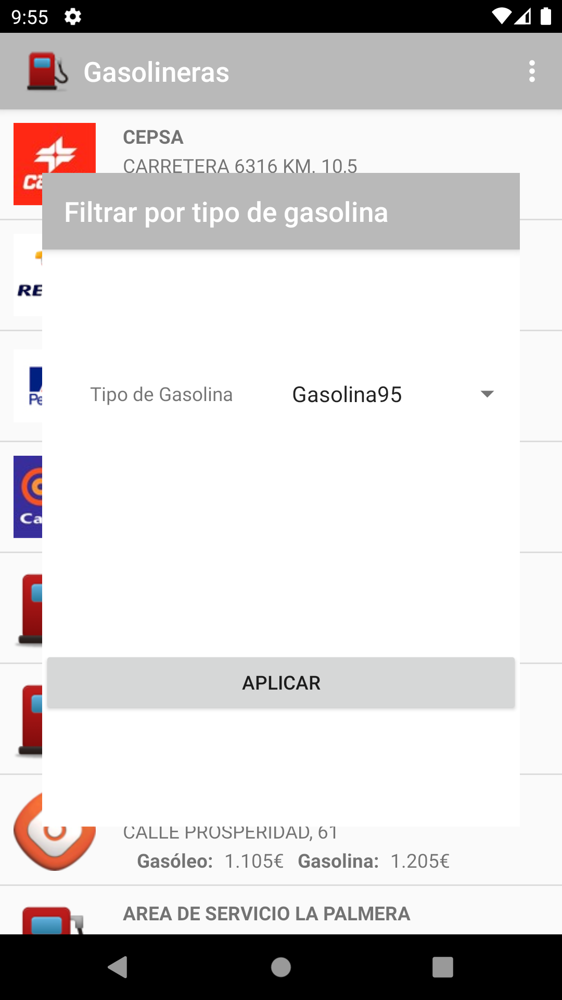
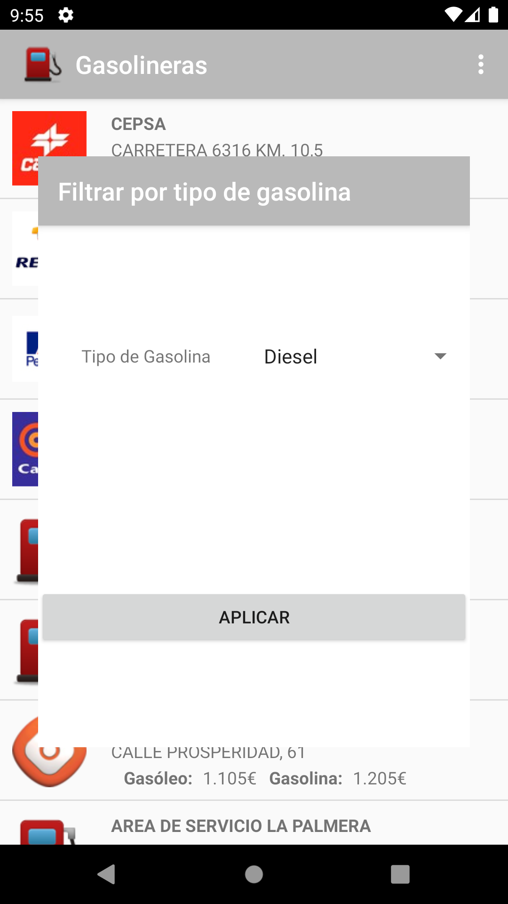
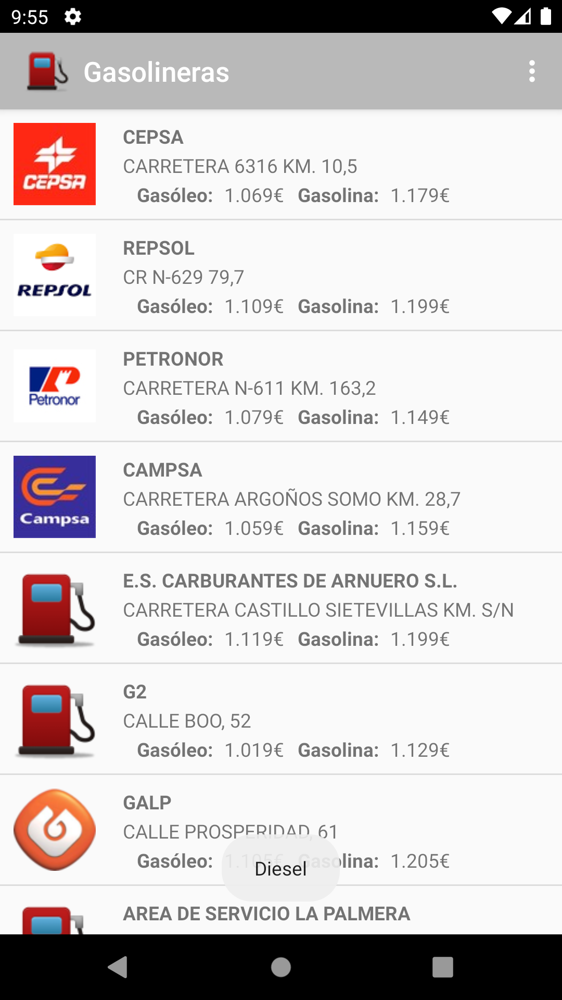

# 1.-Descripción de la aplicación.
La aplicación desarrollada por el grupo de trabajo _A todo gas_ es una aplicación para smartphones con sistema operativo android 10 e inferior.

La aplicación permite al usuario hacer busquedas de gasolineras a nivel nacional, pudiendo consultar información como los tipos de combustibles disponibles, el precio de los combustibles, horarios de las gasolineras...

Es una aplicación enfocada al uso profesional, pero puede ser utilizada sin problemas por usuarios de cualquier tipo.

# 2.-Instalación.
Para la instalación de la aplicación se necesita tener el archivo .apk producido por el equipo de desarrollo e instalarlo en nuestro dispositivo, aunque en un futuro, la aplicación estará disponible en google play.

# 3.-Dentro de la app.

## 3.1.-Pantalla principal.

## 3.2.-Menú lateral.

### 3.2.1.- Filtrar gasolineras por tipo de combustible.

### 3.2.2.- Filtrar gasolineras por marca.
### 3.2.3.-Añadir tarjetas de descuento.
