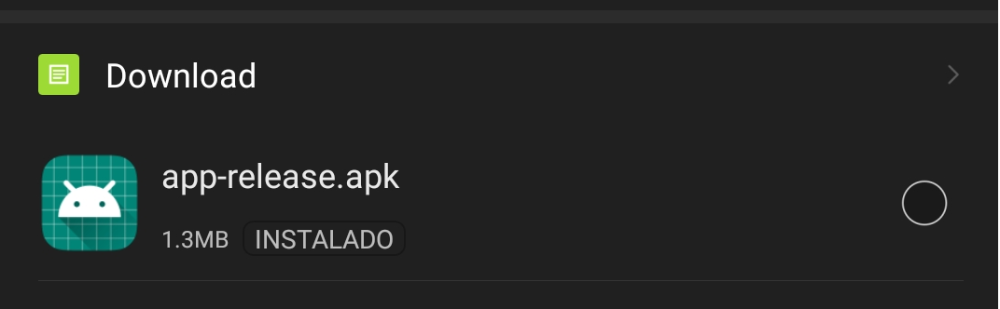
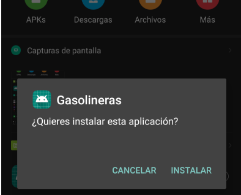
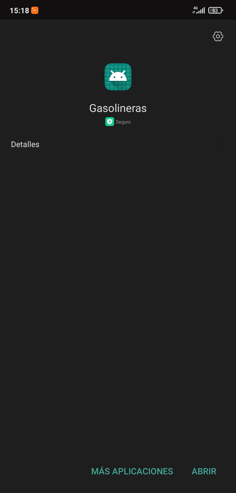
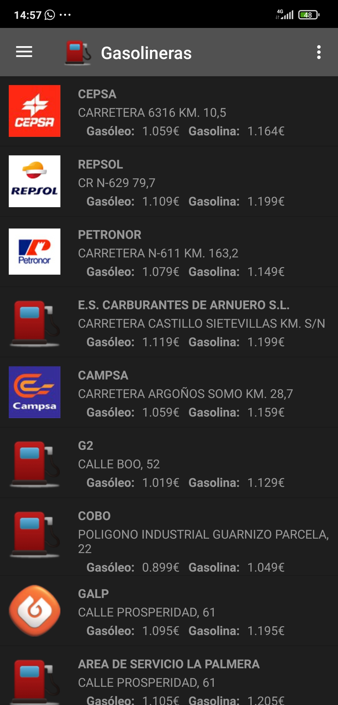
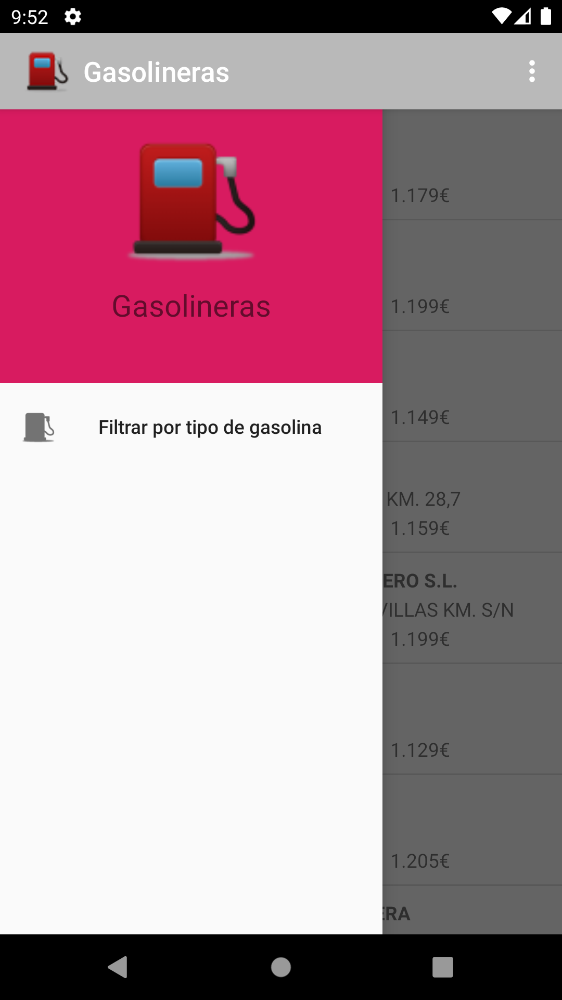

# 1.-Descripción de la aplicación
La aplicación desarrollada por el grupo de trabajo _A todo gas_ es una aplicación para smartphones con sistema operativo android 10 e inferior.

La aplicación permite al usuario hacer busquedas de gasolineras a nivel nacional, pudiendo consultar información como los tipos de combustibles disponibles, el precio de los combustibles, horarios de las gasolineras...

Es una aplicación enfocada al uso profesional, pero puede ser utilizada sin problemas por usuarios de cualquier tipo.

# 2.-Instalación
Para la instalación de la aplicación se necesita tener el archivo .apk producido por el equipo de desarrollo e instalarlo en nuestro dispositivo, aunque en un futuro, la aplicación estará disponible en google play.
Una vez obtenido el archivo .apk, se necesitaría instalarla, para ello se puede seguir el siguiente tutorial:

+ **1.-**Primero se debe abrir una aplicación de explorador de archivos y localizar donde está el archivo .apk descargado, esta debe aparecer de la siguiente forma:

+ **2.-**Después se ha de clickar el archivo, lo cual abrirá una nueva ventana de dialogo informando que no se puede instalar la aplicación al ser de una fuente desconocida:

En esta ventana se ha de pulsar en ajustes para poder continuar con la instalación.

+ **3.-**Una vez hayamos abiertos los ajustes, necesitaremos clicar el boton que nos permite autoriza las descargas de esta fuente.

+ **4.-**Después de haber autorizado las descargas podremos terminar la instalación de la apk:

+ **5.-**Una vez se haya acabado la instalación de la aplicación podremos abrirla a partir de la siguente venatan mediante el botón abrir:

# 3.-Dentro de la app

## 3.1.-Pantalla principal
Al ejecutar la aplicación veremos la pantalla principal:

En esta podemos observar en la parte superior una action bar con dos botones, siendo el botón izquierdo el que abre el menú lateral **(3.2.-)** y el botón derecho abre un menú externo en el que podemos ver dos botones, el primero nos permite actualizar manualmente la información de las gasolineras y el segundo nos muestra información acerca de la aplicación en una nueva ventana.

# 4.-Funcionalidades
## 4.1.-Filtrar gasolineras por tipo de combustible
Para acceder a la funcionalidad de filtrar gasolineras por tipo de combustible necesitaremos primero pulsar el botón situado en la parte superior izquierda de la pantalla principal, lo cual abrirá el menú lateral:

Después de abrirse este menú lateral tendremos que elegir la opción de **Filtrar por tipo de gasolina**, esto a su vez abrirá una ventana de dialogo en la que se nos permite escoger por que tipo de gasolina queremos filtrar la información de las gasolineras mostadas en la pantalla principal:

Para esto tendremos 2 opciones para seleccionar, filtrar por gasolina 95 o por diesel.
Una vez seleccionado el tipo de gasolina por el que filtrar, deberemos pulsar el botón aceptar par aplicar los filtros.

### 3.2.2.- Filtrar gasolineras por marca.
### 3.2.3.-Añadir tarjetas de descuento.
